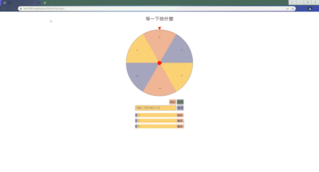

<h1>WhatToEatLater</h1>
    前往<a href="https://fen870916.github.io/WhatToEatLater/" target="_blank"
      >作品</a
    >
    <h2>功能</h2>
    <h3>新增</h3>
    <li>輸入非空白文字後按下新增按鈕即可新增選項</li> 
    
    <h3>編輯</h3>
    <li>按下文字框後可以編輯</li> 
    <li>編輯完需按下編輯完成</li> 
    <li>編輯所輸入的文字不能為空白</li> 
    
    <h3>刪除</h3>
    <h3>開始</h3>
    <h3>重置</h3>
